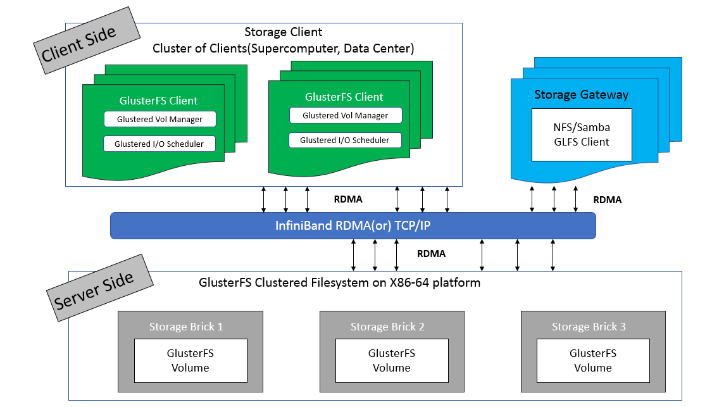
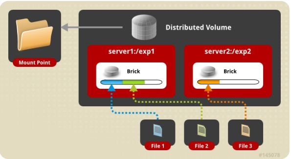
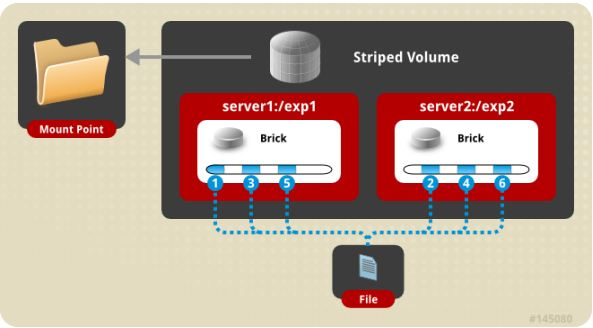
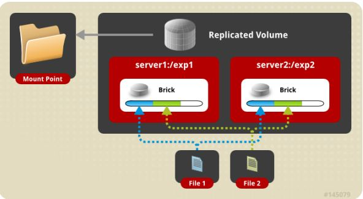
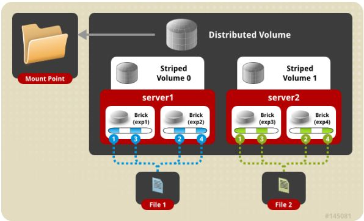
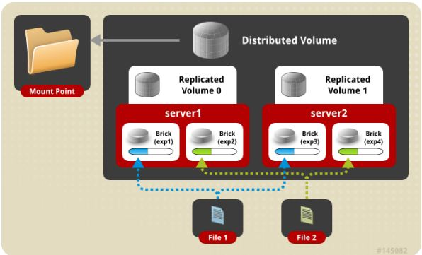
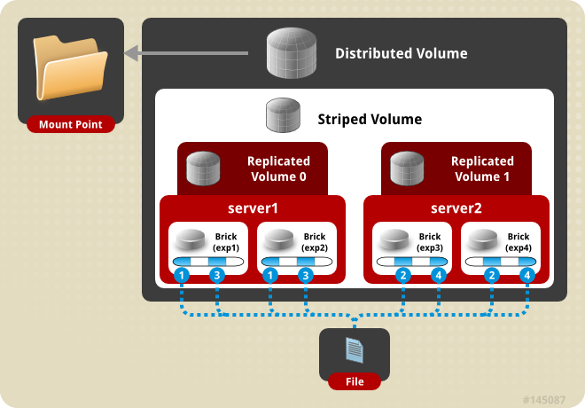

主要由存储服务器（Brick Server）、客户端以及 NFS/Samba 存储网关组成。不难发现，GlusterFS 架构中没有元数据服务器组件，这是其最大的设计这点，对于提升整个系统的性能、可靠性和稳定性都有着决定性的意义。

* GlusterFS 支持 TCP/IP 和 InfiniBand RDMA 高速网络互联。
* 客户端可通过原生 GlusterFS 协议访问数据，其他没有运行 GlusterFS 客户端的终端可通过 NFS/CIFS 标准协议通过存储网关访问数据（存储网关提供弹性卷管理和访问代理功能）。
* 存储服务器主要提供基本的数据存储功能，客户端弥补了没有元数据服务器的问题，承担了更多的功能，包括数据卷管理、I/O 调度、文件定位、数据缓存等功能，利用 FUSE（File system in User Space）模块将 GlusterFS 挂载到本地文件系统之上，实现 POSIX 兼容的方式来访问系统数据。

术语:
* Brick: 最基本的存储单元，表示为trusted storage pool中输出的目录，供客户端挂载用。
* Volume: 一个卷。在逻辑上由N个bricks组成。
* FUSE: Unix-like OS上的可动态加载的模块，允许用户不用修改内核即可创建自己的文件系统。
* Glusterd: Gluster management daemon，要在trusted storage pool中所有的服务器上运行。
* POSIX: 一个标准，GlusterFS兼容。

### distribute volume 分布式卷
基于 Hash 算法将文件分布到所有 brick server，只是扩大了磁盘空间，不具备容错能力。由于distribute volume 使用本地文件系统，因此存取效率并没有提高，相反会因为网络通信的原因使用效率有所降低，另外本地存储设备的容量有限制，因此支持超大型文件会有一定难度。

### stripe volume 条带卷
类似 RAID0，文件分成数据块以 Round Robin 方式分布到 brick server 上，并发粒度是数据块，支持超大文件，大文件的读写性能高。

### replica volume 复制卷
文件同步复制到多个 brick 上，文件级 RAID1，具有容错能力，写性能下降，读性能提升。Replicated 模式，也称作 AFR（Auto File Replication），相当于 RAID1，即同一文件在多个镜像存储节点上保存多份，每个 replicated 子节点有着相同的目录结构和文件，replica volume 也是在容器存储中较为推崇的一种。

### distribute stripe volume 分布式条带卷
Brick server 数量是条带数的倍数，兼具 distribute 和 stripe 卷的特点。分布式的条带卷，volume 中 brick 所包含的存储服务器数必须是 stripe 的倍数(>=2倍)，兼顾分布式和条带式的功能。每个文件分布在四台共享服务器上，通常用于大文件访问处理，最少需要 4 台服务器才能创建分布条带卷。

### distribute replica volume 分布式复制卷
Brick server 数量是镜像数的倍数，兼具 distribute 和 replica 卷的特点,可以在 2 个或多个节点之间复制数据。分布式的复制卷，volume 中 brick 所包含的存储服务器数必须是 replica 的倍数(>=2倍)，兼顾分布式和复制式的功能。

### distribute stripe replica volume：分布式条带复制卷

yum install -y centos-release-gluster
yum install -y glusterfs glusterfs-server glusterfs-fuse glusterfs-rdma

/etc/hosts
加入主机映射

systemctl start glusterd.service

加入集群命令 
gluster peer probe hostname

把某台机器删除集群
gluster peer detach hostname

查看状态
gluster peer status

mkdir -p /data/gfsdata
gluster volume create gv0 replica 2 10.1.50.199:/data/gfsdata 10.1.50.202:/data/gfsdata

不建议使用系统分区，如果执意使用最后加 force

gluster volume start gv0
gluster volume info
gluster volume set gv0 nfs.disable off

查看配置
cat /etc/glusterfs/glusterd.vol 

清除配置
rm -rf /var/lib/glusterd/
systemctl restart glusterd.service

删除卷
gluster volume stop gv0 
gluster volume delete gv0

加节点
gluster peer probe 10.0.21.243 # 加节点 
gluster peer probe 10.0.21.244 # 加节点 
gluster volume add-brick gv0 10.0.21.243:/data/glusterfs 10.0.21.244:/data/glusterfs # 合并卷

# 收缩卷
gluster volume remove-brick gv0 10.0.21.243:/data/glusterfs 10.0.21.244:/data/glusterfs start # 开始迁移 
gluster volume remove-brick gv0 10.0.21.243:/data/glusterfs 10.0.21.244:/data/glusterfs status # 查看迁移状态 
gluster volume remove-brick gv0 10.0.21.243:/data/glusterfs 10.0.21.244:/data/glusterfs commit # 迁移完成后提交

# 迁移卷
gluster peer probe 10.0.21.245 # 将10.0.21.246数据迁移到10.0.21.245先将10.0.21.245加入集群 
gluster volume replace-brick gv0 10.0.21.246:/data/glusterfs 10.0.21.245:/data/glusterfs start # 开始迁移 
gluster volume replace-brick gv0 10.0.21.246:/data/glusterfs 10.0.21.245:/data/glusterfs status # 查看迁移状态 
gluster volume replace-brick gv0 10.0.21.246:/data/glusterfs 10.0.21.245:/data/glusterfs commit # 数据迁移完毕后提交 
gluster volume replace-brick gv0 10.0.21.246:/data/glusterfs 10.0.21.245:/data/glusterfs commit -force # 如果机器10.0.21.246出现故障已经不能运行,执行强制提交 
gluster volume heal gv0 full # 同步整个卷

client:
yum -y install glusterfs glusterfs-fuse
mkdir /mnt/glusterfs
mount -t glusterfs 10.1.50.199:/gv0 /mnt/glusterfs
mount -t fuse.glusterfs

