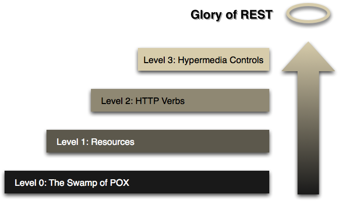
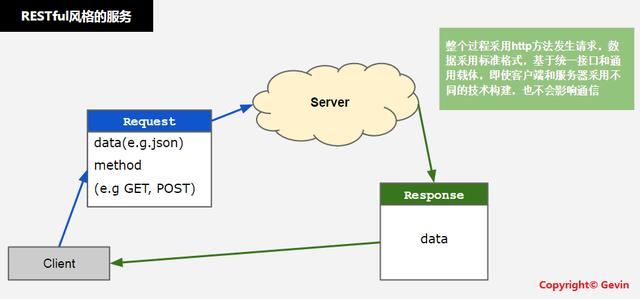

REST即Representational State Transfer的缩写，可译为"表现层状态转化”。REST最大的几个特点为：资源、统一接口、URI和无状态

Level0和Level1最大的区别，就是Level1拥有了Restful的第一个特征——面向资源，这对构建可伸缩、分布式的架构是至关重要的。同时，如果把Level0的数据格式换成Xml，那么其实就是SOAP，SOAP的特点是关注行为和处理，和面向资源的RESTful有很大的不同。
Level0和Level1，其实都很挫，他们都只是把HTTP当做一个传输的通道，没有把HTTP当做一种传输协议。

Level2，真正将HTTP作为了一种传输协议，最直观的一点就是Level2使用了HTTP动词，GET/PUT/POST/DELETE/PATCH....,这些都是HTTP的规范，规范的作用自然是重大的，用户看到一个POST请求，就知道它不是幂等的，使用时要小心，看到PUT，就知道他是幂等的，调用多几次都不会造成问题，当然，这些的前提都是API的设计者和开发者也遵循这一套规范，确保自己提供的PUT接口是幂等的。

Level3，关于这一层，有一个古怪的名词，叫HATEOAS（Hypertext As The Engine Of Application State），中文翻译为“将超媒体格式作为应用状态的引擎”，核心思想就是每个资源都有它的状态，不同状态下，可对它进行的操作不一样。理解了这一层，再来看看REST的全称，Representational State Transfer，中文翻译为“表述性状态转移”，是不是好理解多了？

Level3的Restful API，给使用者带来了很大的便利，使用者只需要知道如何获取资源的入口，之后的每个URI都可以通过请求获得，无法获得就说明无法执行那个请求。

现在绝大多数的RESTful接口都做到了Level2的层次，做到Level3的比较少。当然，这个模型并不是一种规范，只是用来理解Restful的工具。所以，做到了Level2，也就是面向资源和使用Http动词，就已经很Restful了。Restful本身也不是一种规范，我比较倾向于用"风格"来形容它。

### 资源
是以json(或其他Representation)为载体的、面向用户的一组数据集，资源对信息的表达倾向于概念模型中的数据：
* 资源总是以某种Representation为载体显示的，即序列化的信息
* 常用的Representation是json(推荐)或者xml（不推荐）等
* Representation 是REST架构的表现层

### 统一接口
* GET（SELECT）：从服务器取出资源（一项或多项）。
* POST（CREATE）：在服务器新建一个资源。
* PUT（UPDATE）：在服务器更新资源（客户端提供完整资源数据）。
* PATCH（UPDATE）：在服务器更新资源（客户端提供需要修改的资源数据）。
* DELETE（DELETE）：从服务器删除资源。

### ULI
可以用一个URI（统一资源定位符）指向资源，即每个URI都对应一个特定的资源。要获取这个资源，访问它的URI就可以，因此URI就成了每一个资源的地址或识别符。
一般的，每个资源至少有一个URI与之对应，最典型的URI即URL。

### 无状态
所谓无状态的，即所有的资源，都可以通过URI定位，而且这个定位与其他资源无关，也不会因为其他资源的变化而改变。有状态和无状态的区别，举个简单的例子说明一下。如查询员工的工资，如果查询工资是需要登录系统，进入查询工资的页面，执行相关操作后，获取工资的多少，则这种情况是有状态的，因为查询工资的每一步操作都依赖于前一步操作，只要前置操作不成功，后续操作就无法执行；如果输入一个url即可得到指定员工的工资，则这种情况是无状态的，因为获取工资不依赖于其他资源或状态，且这种情况下，员工工资是一个资源，由一个url与之对应，可以通过HTTP中的GET方法得到资源，这是典型的RESTful风格。

* ROA即Resource Oriented Architecture
* RPC: remote procedure call
* SOAP: Simple Object Access Protocol 

由于RESTful风格的服务是无状态的，认证机制尤为重要。
* basic auth
* token auth
* OAuth

